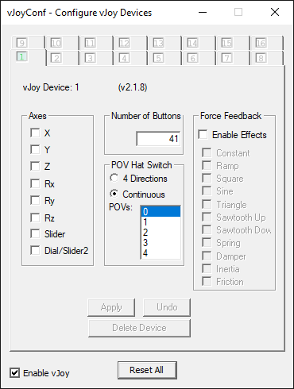
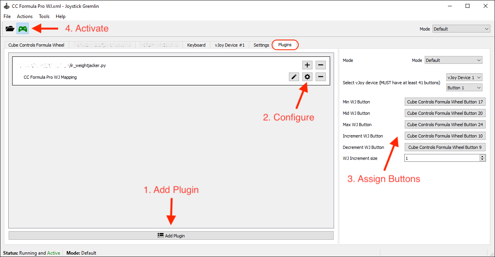

## irwjplugin - iRacing Weight Jacker plugin for Joystick Gremlin

### Background ###

In iRacing you have two options for adjusting the weight jacker. You can adjust it incrementally, one click at a time, OR you can configure it as a rotary encoder and immediately set a WJ value with a single button press.

The default +/- button assignment method in iRacing is fairly self explanatory. You hit + to increase the weight jacker and - to decrease it. The problem is that if you want to go from +10 to -20 to reduce drag on the straight, you need to click the button 30 times. Not cool. (Indycar drivers do this in real life, but unlike iRacing their weight jacker button increments are customizable so they do not need to frantically mash buttons while driving at 230mph)

Conversely, the rotary encoder approach is great because you can instantly select a value without frantic clicking, but you would need 41 buttons on your steering wheel to cover every setting between -20 and 20. This is impractical, even physical rotary encoders on high-end steering wheels do not have >40 positions. This means you lose precision and are unable to select the *exact* weight jacker value that you need. Even the black box control will not let you adjust the setting when using a rotary encoder, not ideal.

### About irwjplugin ###

This software project is a plugin for Joystick Gremlin that aims to give you the best of both worlds. It provides button assignments to instantly select three different WJ values *AND* allows you to dynamically adjust those values on the fly.

The plugin needs a total of 5 buttons to be assigned, the first 3 are for instantly selecting values-
* **Min WJ Button** - Set the weight jacker to the minimum value (default is -20)
* **Mid WJ Button** - Set the weight jacker to the middle value (default is 0)
* **Max WJ Button** - Set the weight jacker to the maximum value (default is +20)

These are for adjusting the values, I typically assign these to a rotary dial on my wheel-
* **Increment WJ Button** - Increase the current WJ setting
* **Decrement WJ Button** - Decrease the current WJ setting

When you are in the car you press the **Max WJ Button** to instantly select WJ +20. Then use the **Increment / Decrement** dial to change the WJ. Not only does it change the current WJ setting, but it *also* dynamically changes the setting of the **Max WJ Button** in real time, so that the next time you press the button you will get your new WJ setting.

The same adjustments can be made to the Min and Mid settings, just press the **Min** or **Mid** buttons and the turn the dial. Each setting is adjusted independently and this can all be done from the cockpit while you are driving.

This provides maximum flexibility with the fewest possible button assignments.

### Prerequisites ####

* Install and configure [vJoy](https://github.com/shauleiz/vJoy/releases)
  * Run the "Configure vJoy" utility and configure your vJoy device to have at least **41 buttons.**  If you are already using vJoy for other purposes, create a NEW vJoy device using the configuration utility, and set it to have 41 buttons.
  * The configuration will look something like this-

    

  * You must **REBOOT** after configuration.
* Install [Joystick Gremlin](https://whitemagic.github.io/JoystickGremlin/download/)

### Joystick Gremlin Setup ###

* Run Joystick Gremlin and go to the **Plugins** tab.
* Add a plugin, select the ir_weightjacker.py file.
* Click on the small gear to configure the plugin.
	* Make sure the correct vJoy device is selected.
      * Confirm all 41 buttons appear in the dropdown.
	* Click on each of the button assignments to assign them.
* Click on the **Activate** button on the toolbar. 
* Illustration below-

  

* **Save** the configuration in Joystick Gremlin, you can also make it auto-activate in the settings if you prefer.
* *Optional:* Launch **vJoy Monitor** and verify the buttons on the vJoy device are triggered as you press different buttons.

### iRacing Setup ###

* Ensure the buttons that you assigned in Joystick Gremlin are not *also* assigned in iRacing, as this may give unexpected results.
* Launch iRacing and go to **Options -> Controls**
  * Select right rear spring offset.
  * Set the type dropdown to **"Use rotary knob (analog or digital)"**.
    * Leave the second dropdown set at **"No offset"**.
  * Press and release the button assigned to **Minimum WJ**.
  * Press and release the button assigned to **Maximum WJ**.
  * iRacing should show the **"Dev # qaxis 0-40"** in the calibration dialog.
* Click **Done**

Please note that the plugin is only working when Joystick Gremlin is running and the config is **Active**. Simply exiting Joystick Gremlin will revert your buttons to their original behavior. I suggest enabling the "Use custom controls for this car" feature for the vehicles you intend to use with this plugin.
